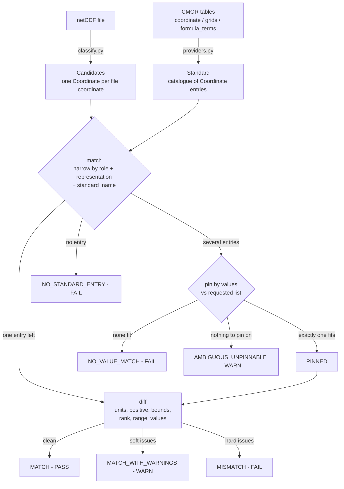

# coordinate_standard

Checks a file's coordinates against the CMOR tables: build a "standard"
from the tables, classify the file the same way, compare the two. The
mismatches are the compliance findings.

## How a file flows through

The outcomes become Result objects in
`checks/coordinate_checks/check_coordinates.py` (COORD001), which also
hands direction to [VAR005] and missing variables to [VAR001].

## The files

- `model.py`: the shared vocabulary. `Role` (LATITUDE, TIME, VERTICAL,
  GRID_X, ...), `Representation` (DIMENSION, AUXILIARY, SCALAR, ...),
  `VariableKind`, and the `Coordinate` / `Standard` dataclasses. Both sides
  are normalized into `Coordinate`, which is what makes comparison simple.
- `rules.py`: decides role and representation. standard_name wins; axis
  alone is ambiguous. No standard_name at all? `_role_from_weak_signals`
  guesses from units and names (detectors from compliance-checker, name
  patterns from cf-xarray, no hand-kept name lists).
- `classify.py`: walks an open netCDF4 dataset into candidates. The
  structural detection (dim/aux/bounds/grid mappings) is
  compliance-checker's.
- `providers.py`: CMOR tables in, `Standard` out. Also the esgvoc seam:
  `EsgvocProvider` stays a stub until the universe has value-level
  metadata (`esgvoc_readiness()` shows the gap).
- `matching.py`: `match`, `diff`, `missing_coordinates`. The comparison
  logic lives here.
- `report.py`: the plain-text PASS/WARN/FAIL report. CLI wrapper:
  `checks/coordinate_checks/classify_file.py`.
- `__init__.py`: re-exports everything, so imports don't care about the
  internal layout.

## Why pinning

A standard_name only gives the role: `air_pressure` is plev8, plev19 and
plev39 at once. So the match keeps all of them and compares the file's
values against each entry's `requested` list (within the table
`tolerance`). Whichever fits is the pinned entry. `diff` re-verifies
requested/value even when only one entry matched, so wrong levels can't
slip through unpinned.

## Edge cases

Parametric verticals

- Ocean sigma coordinates list themselves in their own formula_terms
  ("sigma: sigma ..."): anything carrying a formula_terms attribute is a
  coordinate, never someone else's term.
- Sloppy spacing ("term : var") parses fine.

Scalars

- height2m stored 0-D, or 1-D with length 1, with or without a
  coordinates-attribute reference: all classify SCALAR, rank 0.

Grids

- rlon/rlat, nlon, nav_lon, gdep etc. are covered by the cf-xarray name
  patterns; rlon/rlat become GRID_X/GRID_Y, separate from geographic
  lon/lat.
- HEALPix/unstructured files store aux lat/lon as 1-D `lat(cells)`; the
  tables only know the 2-D form. Rank mismatch on an auxiliary is
  therefore a warning. On a dimension coordinate it stays a failure.

Units

- Everything goes through udunits, never string comparison. hPa vs Pa
  warns, not-convertible fails, missing units warn when the table expects
  some.
- "days since ?" accepts any reference date; hours-instead-of-days warns;
  anything else fails with a template message (udunits never sees the "?").
- tolerance 0 in the table means exact; only an absent tolerance falls
  back to a small relative one.

Weak files (no standard_name, no axis)

- Still classified via units/names; the report marks them "role inferred".
- Integer i/j/k and character axes are never name-guessed, so they end up
  INDEX / CATEGORY, not grid axes.
- time/lat/lon variants with nothing to pin on: AMBIGUOUS_UNPINNABLE, a
  warning. Separating time1/time2 needs cell_methods; still open.

Missing things

- A dimension in use with a matching table out_name but no variable:
  reported missing.
- Scalar coords and 2-D aux lat/lon are never dimensions, so they are only
  caught when the caller passes `ct_dimensions` (the variable-table
  dimensions tokens). A token is satisfied by any of its entries'
  out_names; unknown tokens are skipped.
- Bounds required but absent fails in diff. Bounds correctness belongs to
  VAR004/VAR012, direction to VAR005.

Robustness

- A malformed table entry fails that one coordinate, not the whole run
  (guarded in the glue).
- esgvoc is a soft dependency; absent means the name-level checks stay
  silent.
- New table releases flow through automatically (tables are read at
  runtime). If cf-xarray reshapes its vocabulary tables,
  `tests/test_cf_vocab.py` fails in CI.
